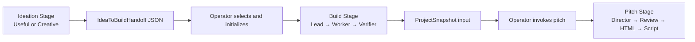

# HackSome Stage-oriented Repository — Technical Design

## 1. Target Shape

```text
HackSome/
├── src/hacksome/
│   ├── cli.py
│   ├── core/
│   │   ├── codex.py
│   │   ├── config.py
│   │   ├── models.py
│   │   ├── prompting.py
│   │   ├── state.py
│   │   ├── hub.py
│   │   └── task_executor.py
│   ├── contracts/
│   │   ├── idea_to_build.py
│   │   └── build_to_pitch.py
│   └── stages/
│       ├── ideation/
│       │   ├── useful/
│       │   ├── creative/
│       │   └── review_ui/
│       ├── build/
│       │   ├── control/
│       │   ├── agent_runtime/
│       │   └── assets/
│       └── pitch/
├── ops/build/
│   ├── Makefile
│   ├── docker-compose.yml
│   ├── docker/
│   └── account-templates/
├── tests/
│   ├── core/
│   ├── contracts/
│   └── stages/
│       ├── ideation/
│       ├── build/
│       └── pitch/
└── .trellis/
```

`src/hacksome` 是唯一生产 Python namespace。`ops/build` 只保存本地/容器运行
入口，不定义第二个产品或第二套开发工作流。

## 2. Runtime Flow



两处 operator 节点是本轮有意保留的产品边界，不是待偷偷补齐的实现空洞。

## 3. Ownership Boundaries

### Core

只包含至少被两个 Stage 使用、且没有 Stage 产品语义的机制：

- Codex process/runtime adapter
- immutable Prompt/Schema loading
- atomic state and JSONL helpers
- shared model/config primitives
- generic task execution

“看起来通用”不足以进入 Core；先有两个真实 consumer 才抽取。

### Ideation

- `useful/` 拥有当前 package 根的 Useful workflow、artifact 与 Prompt/Schema。
- `creative/` 拥有 C0–C7、Idea Memory、C6 review、finalization 与 benchmark。
- review UI 属于 Creative Human Review，不再放在 `hacksome/review_ui` 顶层。
- route projection 拆为 registry/core 与各 route 自己的 validation module，避免
  继续增长单个超长 `routes.py`。

### Build

- `control/` 拥有 Team Hub、Team scheduler、Team store、Worker/Verifier managers、
  control client 与 HTTP boundary。
- `agent_runtime/` 拥有 Codex/Claude adapter、AgentSpec、loadout materialization
  与 resident/ephemeral loops。
- `assets/` 拥有 Lead/Worker/Verifier charters、AgentSpec YAML、MCP 配置和必要脚本。
- Company/mail/Department/Objective/Peripheral 仅在 active dependency closure
  证明需要时保留；否则删除。

### Pitch

- 拥有 immutable Project snapshot、四角色串行流程、HTML contract、browser smoke、
  Pitch Prompt/Schema 与发布产物。
- Pitch 使用 `BuildToPitchInput` 校验手工提供的三份输入，但不自动发现 Team。

## 4. Handoff Contracts

`contracts/idea_to_build.py` 对应现有 Creative JSON：

```text
source_run_id
idea_card_id
idea_card_sha256
challenge_markdown
initial_idea_card_markdown
```

本轮只把解析、验证和 canonical hash 规则放在共享 contract；CLI 不自动消费。

`contracts/build_to_pitch.py` 表达当前 Pitch 的手工输入：

```text
project_directory
idea_card_file
challenge_file
```

它只负责输入存在性、不可变 snapshot boundary 与来源记录，不增加 Team lookup。

## 5. Compatibility Strategy

### Python imports

先移动实现，再在旧位置保留薄 shim，例如：

```python
from hacksome.stages.ideation.creative.workflow import *
```

内部代码立即使用新路径；测试逐步切换。shim 不包含状态、常量副本或第二份资源。

### CLI

`hacksome.cli:main` 和所有现有命令不变。目录整理不与 CLI 重设计绑定。

### Frozen runs

- frozen Prompt/Schema bytes 继续从 run manifest 读取。
- 兼容 catalog 必须能加载历史 contract/template version。
- 路径变化后用现有 frozen-run fixtures 验证，而不是只跑新 run unit tests。

### Build containers

- 先让 Compose 指向新 Python module/assets，再删除旧路径。
- 一段迁移期内允许 `ops/build` wrapper 设置新的 `PYTHONPATH` 与 mount。
- 不保留第二份 Build 实现；如需过渡，旧入口仅调用新入口。

## 6. Migration Units

每个 Unit 独立提交并通过自己的质量门：

1. Baseline and dead-code closure
2. Core extraction
3. Ideation package move
4. Pitch package/resource move
5. Build active runtime move
6. Test and documentation reorganization
7. Compatibility-shim audit

Build move最后执行，因为 Docker path、module name 和 asset mount 的风险最高。

## 7. Rollback

- 所有移动使用 `git mv`，每个 Unit 单独提交。
- Unit 验证失败时只回退该 Unit，不跨阶段回滚。
- 不迁移 mutable runtime state；原 state 目录保持 ignored。
- 删除 legacy Build 源码前记录 active dependency closure 和删除清单，Git 历史
  是唯一长期 archive。
